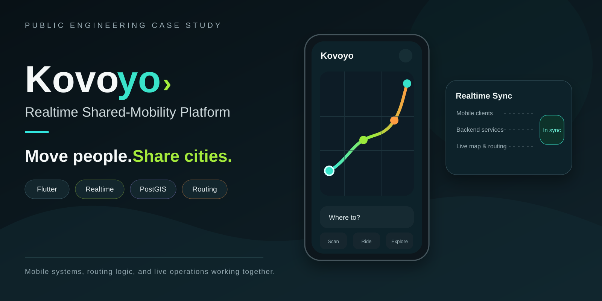
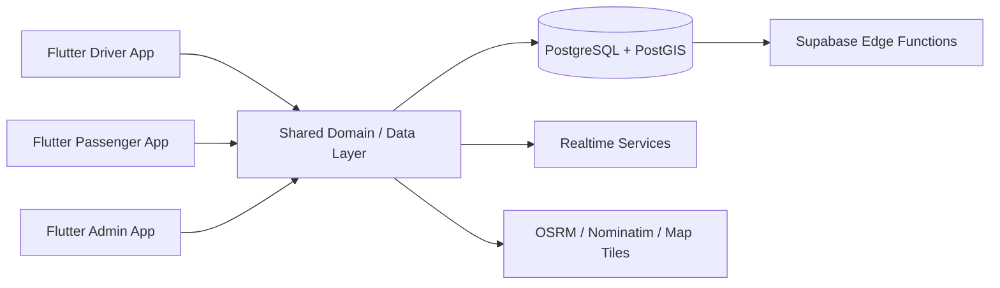

> **Visual overview:** conceptual case-study artwork based on the route, mobile, and realtime architecture. It does not represent live fleet or user data.

# Kovoyo — Realtime Shared-Mobility Platform

**Public engineering case study by [Levent Aydin](https://github.com/LEVENT-AY)**  
Senior Full-Stack, Mobile & AI Automation Engineer

> The production repository is private. This showcase documents product rules, architecture, and engineering decisions without publishing proprietary source code, credentials, or user data.

## 30-second recruiter scan

- **System:** three Flutter applications — driver, passenger, and admin — built around route-authority rules, realtime state, and geospatial data.
- **My ownership:** Flutter architecture, shared domain/data packages, realtime flows, PostgreSQL/PostGIS integration, routing/search services, mobile UX, and production debugging on physical devices.
- **What it proves:** I can build production mobile systems where realtime behavior, maps, lifecycle state, and domain rules have to remain consistent across multiple apps.

## At a glance

| | |
|---|---|
| **Mobile** | Flutter · Dart |
| **Data** | PostgreSQL · PostGIS · Supabase |
| **Geo** | OSRM · Nominatim · PMTiles |
| **Focus** | Realtime state · route integrity · maps · mobile lifecycle |

## The engineering problem

Kovoyo is deliberately not traditional ride-hailing. A driver publishes a route and that route remains authoritative. Passengers join at compatible points instead of silently changing the driver's journey.

That product rule means **matching, realtime state, map UX, and route lifecycle must all preserve route integrity** while still feeling immediate to both sides.

## Architecture

## What I built and owned

- Separate Flutter driver, passenger, and administration applications.
- Shared Dart packages for domain, data, realtime, geo, internationalization, UI, and testing concerns.
- PostgreSQL/PostGIS-backed route and geospatial state.
- Realtime synchronization between driver and passenger workflows.
- Route publication and lifecycle rules built around immutable published routes.
- Routing, geocoding/search, and map-tile integrations.
- Production debugging of route state, camera behavior, overlays, and lifecycle edge cases on real Android hardware.

## Verification evidence

The private repository is a **Melos-managed Dart monorepo** with separate driver, passenger, and admin apps plus shared domain/data/realtime/geo/testing packages. Its database area includes **PostgreSQL + PostGIS schema, RLS policies, and pgTAP tests**, and geo services are explicitly separated into OSRM, Nominatim, and PMTiles components.

Mobile behavior that depends on lifecycle timing, maps, overlays, or camera state is additionally validated on physical Android devices rather than treated as proven by static code or emulator-only inspection.

## Key engineering decisions

### The published route is the contract
Passenger matching is constrained by the driver's published route; the system does not silently rewrite it to optimize pickups.

### Geospatial rules live below presentation
Matching and route behavior are domain/data concerns rather than map-widget logic, keeping UI code simpler and product rules testable.

### Physical-device behavior is first-class evidence
Map camera behavior, lifecycle timing, and overlay interactions are validated on real hardware rather than inferred from code alone.

## Technology

| Layer | Technology / focus |
|---|---|
| Mobile | Flutter, Dart |
| Data | PostgreSQL, PostGIS, Supabase |
| Realtime | Supabase-backed data flows |
| Geo | OSRM, Nominatim, PMTiles |
| Quality | pgTAP, automated tests, physical-device verification |

## What this demonstrates

Production Flutter engineering across multiple applications, realtime state, and geospatial systems — with architecture driven by product invariants rather than UI convenience.

---

**Source policy:** private for commercial and IP reasons. No proprietary source code, credentials, private service configuration, or user data are published here.

[← Back to my engineering profile](https://github.com/LEVENT-AY)
