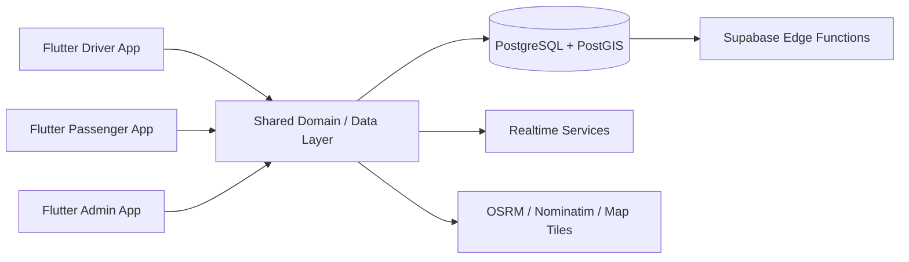

> **Visual overview:** conceptual case-study artwork based on the route, mobile, and realtime architecture. It does not represent live fleet or user data.

# Kovoyo — Realtime Shared-Mobility Platform

**Public engineering case study by [Levent Aydin](https://github.com/LEVENT-AY)**  
Senior Full-Stack, Mobile & AI Automation Engineer

> The production repository is private. This showcase documents product rules, architecture and engineering decisions without publishing proprietary source code, credentials or user data.

## At a glance

| | |
|---|---|
| **Product type** | Route-based shared-taxi mobility platform |
| **Client apps** | Flutter driver · passenger · admin |
| **Data** | PostgreSQL · PostGIS · Supabase |
| **Geo stack** | OSRM · Nominatim · PMTiles |
| **Engineering focus** | Realtime state · geospatial logic · mobile lifecycle · route integrity |
| **My role** | Product behavior, Flutter architecture, realtime flows, geospatial backend design, debugging and mobile UX |

## The engineering problem

Kovoyo is deliberately not traditional ride-hailing. A driver publishes a route and that route remains authoritative. Passengers join at compatible points instead of causing the driver to detour.

That product rule changes the system design: **matching, realtime state, map UX and route lifecycle must all preserve route integrity** while still feeling immediate to both sides of the marketplace.

## Architecture

## What I built and owned

- Separate Flutter applications for driver, passenger and administration workflows.
- Shared Dart packages for domain, data, realtime, geo, internationalization, UI and testing concerns.
- PostgreSQL/PostGIS-backed route and geospatial state.
- Realtime synchronization between driver and passenger workflows.
- Route publication and lifecycle rules built around immutable published routes.
- Integration of routing, geocoding/search and map-tile infrastructure.
- Production debugging of route state, map camera behavior, overlays and lifecycle edge cases.
- Arabic-first mobile UX validated on physical Android devices.

## Core engineering decisions

### 1. The published route is the contract

Passenger matching is constrained by the route the driver published. The system does not silently rewrite the route to optimize pickups.

### 2. Geospatial rules live below presentation

Matching and route behavior are domain/data concerns rather than map-widget logic. This keeps UI code simpler and makes product rules easier to reason about and test.

### 3. Physical-device behavior is first-class evidence

Map camera behavior, lifecycle timing and overlay interactions were validated on real hardware because production mobile behavior cannot be inferred from static code review alone.

## Technology

| Layer | Technology / focus |
|---|---|
| Mobile | Flutter, Dart |
| Data | PostgreSQL, PostGIS, Supabase |
| Realtime | Supabase-backed realtime/data flows |
| Geo | OSRM, Nominatim, PMTiles |
| Architecture | Shared Dart packages and domain boundaries |
| Quality | Automated tests + physical-device verification |

## What this demonstrates

Kovoyo demonstrates production Flutter engineering across **multiple apps, realtime state and geospatial systems**, with architecture driven by explicit product rules rather than UI convenience.

---

**Source policy:** private for commercial and IP reasons. No proprietary source code, credentials, private service configuration or user data are published here.

[← Back to my engineering profile](https://github.com/LEVENT-AY)
